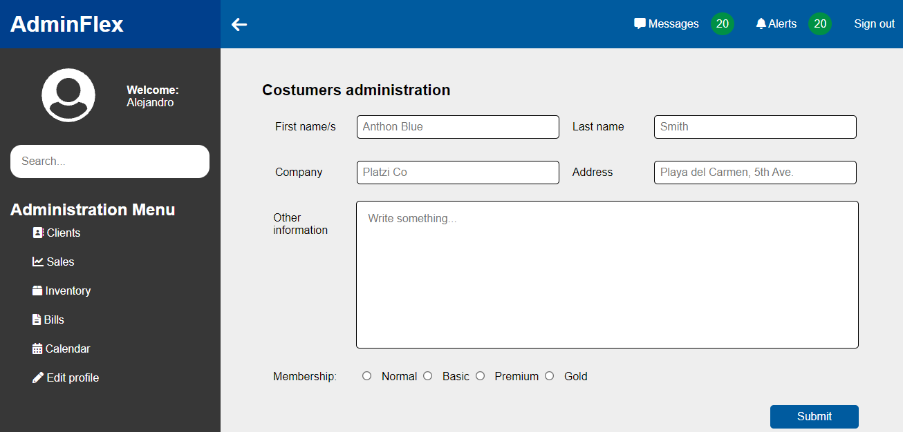
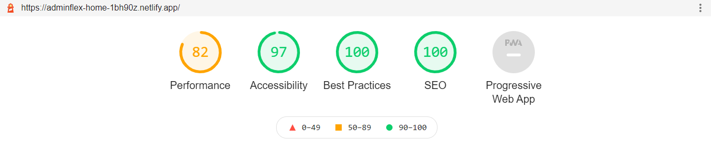

# [AdminFlex](https://adminflex-home-1bh90z.netlify.app/)
The eighth project from Juan Pablo's course of [CSS Grid and Flexbox](https://www.udemy.com/course/css-grid-y-flexbox-la-guia-definitiva-crea-10-proyectos/).

> **Important:** Because the kind of project this is, I prefered to have a minimum inline-size of 1060px in order to avoid unwanted layouts in smaller viewport widths. Smaller ones would have required more complex code, code that'll be added in the future, but by now it's only available for +1060px screens.

> **Disclaimer:** I'm starting to learn how to use **Git/Github** correctly, therefore there'll be plenty of pull requests, commits and other stuff as tests in this repository, however, *this won't represent my way of working forever*, I'll learn more things along the way as always :D!.

## Table of contents
* [What I learned](#what-i-learned)
* [Lectures](#lectures)
* [Preview](#preview)
* [Reports](#reports)
    - [GTmetrix](#gtmetrix)
    - [Lighthouse](#lighthouse)
* [Open Graph](#open-graph)
    - [Facebook](#facebook)
    - [Twitter](#twitter)

## What I learned 🎨
* First I'd like to say that I was reading a bit more since the last project about the use cases of alternative text on images and due to that I left the alt property on the open-graph elements empty because I consider they're unnecessary, they're not giving any important context, the open-graph cards make sense with or without the alt text, therefore, it's better to omit them.

* I added the Netlify basic configuration for a dinamic formulario with reCAPTCHA included, this is something I've already tried in another projects and is very useful because you can receive the information of the forms without having to add anything out of HTML attributes. For more information [check this out](https://docs.netlify.com/forms/setup/).

* This time I learned how to remove an upstream repository from Git by using the **git remote** command followed by the **rm** flag and the upstream you'd like to remove, e.g. **origin**.

> **Important:** recently I've starting to learn more about Git thanks to a book that I bought a few days ago, if everything goes well I'll master Git in the months coming, at least I hope so.

* I had a few issues trying to set up the formulario with Netlify due to the data isn't received as wished in the administration panel, the checkbox section is the only one that's being received which is weird because the structure of the form is practically the same in comparation with other projects where I've used the [Netlify forms feature](https://docs.netlify.com/forms/setup/). By now I've not found any solution to it but I'll keep seeking.

## Lectures 📚
- [Alternative Text](https://webaim.org/techniques/alttext/)
- [Git removing upstream from local respository](https://stackoverflow.com/questions/19801455/git-removing-upstream-from-local-repository)

## Preview 👩‍💻

## Reports 🎯

### GTmetrix

### Lighthouse

## Open Graph 🃏

### Facebook

### Twitter
